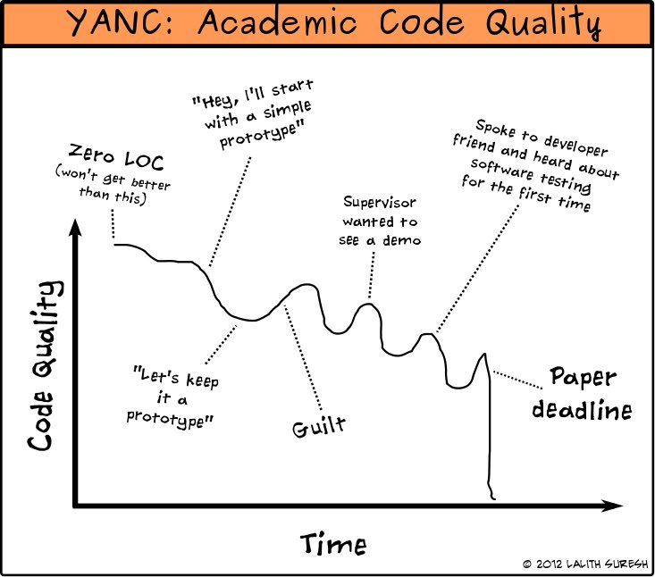
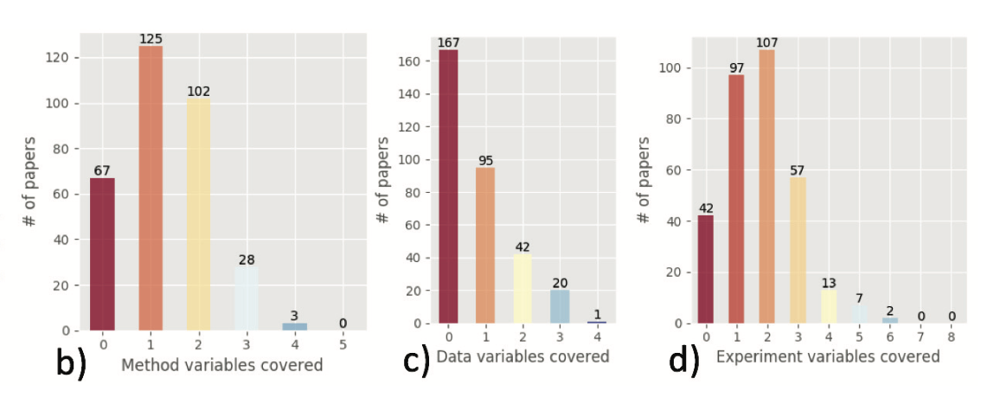
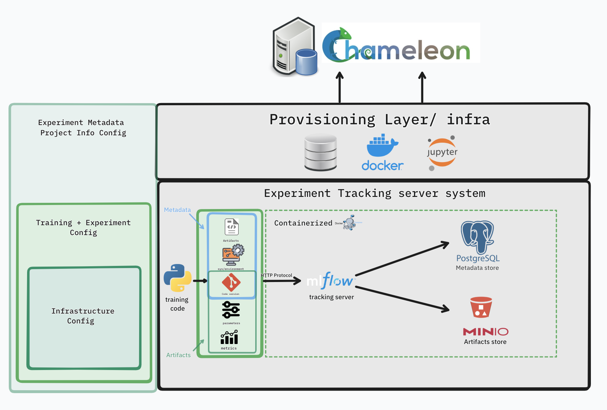

### About the Project 
Hello! I'm Ahmed, an undergraduate Computer Science student at the University of Khartoum I'm working on making machine learning research more reproducible for open access research facilities like [Chameleon testbed](chameleoncloud.org), under the project [Applying MLOps to overcome reproducibility barriers in machine learning research](https://ucsc-ospo.github.io/project/osre25/nyu/mlops/), mentored by Prof. [Fraida Fund](https://ucsc-ospo.github.io/author/fraida-fund/) and [Mohamed Saeed](https://ucsc-ospo.github.io/author/mohamed-saeed/). as part of this project my [proposal](https://docs.google.com/document/d/146PutdVy7cWSf_Gn8qcn0Ba2llMHjNtHIQzZ5a-xRvQ/edit?usp=sharing) aims to build a template generator that generates repositories for reproducible model training on the Chameleon testbed.

### Reproducibility
> *We argue that unless reproducing research becomes as vital and mainstream part of scientific exploration as reading papers is today, reproducibility will be hard to sustain in the long term because the incentives to make research results reproducible won’t outweigh the still considerable costs*
>
> — [Three Pillars of Practical Reproducibility Paper](https://www.chameleoncloud.org/media/filer_public/25/18/25189b96-c3a2-4a55-b99b-c25322fe6682/reproducibility_on_chameleon-3.pdf)

By Reproducibility in science we refer to the ability to obtain consistent results using the same methods and conditions as the previous study. in simple words if I used the same data and metholodgy that was used before, I should obtain the same results. this principle is mapped to almost every scientific field including both Machine Learning research in science and core Machine Learning.

### Challenges in Reproducibility

The same way the famous paper about the [repoducibility crisis in science](https://www.nature.com/articles/d41586-019-00067-3) was published in in 2016, similar discussions have been published discussing this in machine learning research setting, the [paper state of the art reproducibility in artificial intelligence](https://ojs.aaai.org/index.php/AAAI/article/view/11503) after analayzing 400 hundereds papers from top AI conferences, it was found that around 6% shared code, approximately 33% shared test data. In contrast, 54% only shared a pseudocode (summary of the algorithm). 

The lack of software dependency management, proper version control, log tracking, and effective artifacts sharing made it very difficult to reproduce research in machine learning.

Reproducibility in machine learning is largely supported by MLOps practices which is the case in the industry where the majority of researchers are backed by software engineers who are responsible of setting experimental environments or develop tools that streamline the workflow.However, in academic settings reproducibility remains a great challenge, researchers prefer to focus on coding, and worry a little about the the complexities invloved in configuring their experimental environment,As a result, the adaptation and standardization of MLOps practices in academia progress slowly. The best way to ensure a seamleas experience with MLOps, is to make these capabilities easily accessible to the researchers' workflow. by developing a tool that steamlines the process of provisioning resources, enviornment setup, model training and artifacts tracking, that ensures reproducible results.

### Proposed Solution

We want the researchers to spin up ML research instances/bare metal on Chameleon testbed while keeping the technical complexity involved in configuring and stitching everything together abstracted, users simply answer frew questions about their project info, frameworks, tools, features and integrations if there are any, and have a full generated,reproducible project. it contains a provisioning/infrastracture config layer for provisioning resources on the cloud, a dockerfile to spin up services and presistent storage for data,the ML code at its core is a containarized training environment backed by ML tracking server system that logs the artifacts, metadata, environment configuration, system specification (GPUs type) and Git status using Mlflow, powered by a postgresSQL for storing metadata and a S3 Minio bucket to store artifacts.
persistent storage for the artifacts generated from the experiment and the datasets and containarization of all these to ensure reproducibility.we aim to make the cloud experience easier, by dealing with the configuration needed for setting up the environment having a 3rd party framework, enabling seamless access to benchmarking dataset or any necessary components from services like Hugging face and GitHub as an example will be accessible from the container easily.  for more techincal details about the solution you can read my propsal [here](https://docs.google.com/document/d/1ilm-yMEq-UTiJPGMl8tQc3Anl5cKM5RD2sUGInLjLbU).

By addressing these challenges we can accelerate the scientific discovery. this not benefits those who are conducting the research but also the once building on top of it in the future. I look forward to share more updates as the project progresses and I welcome feedback from others interested in advancing reproducibility in ML research.